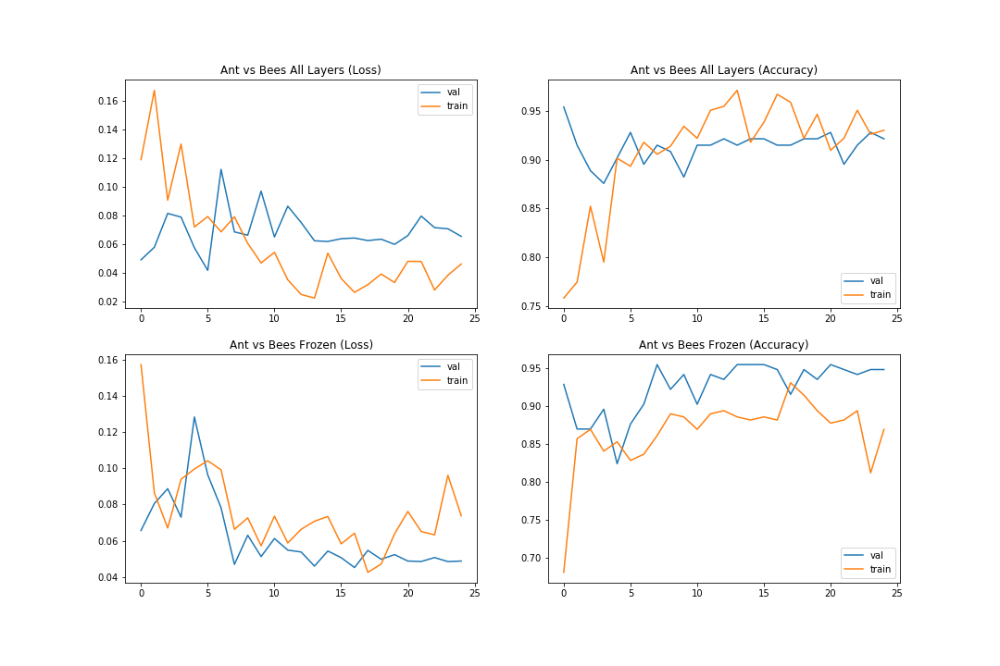
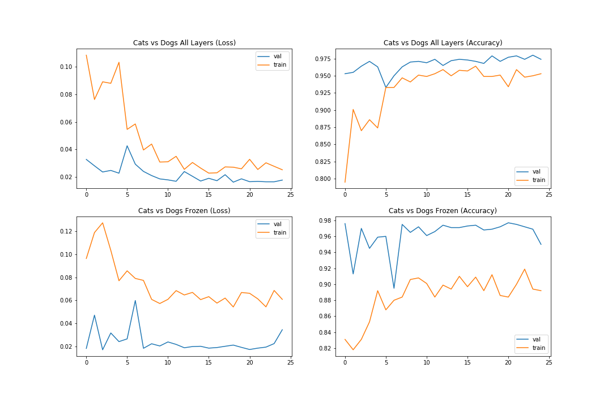

## Transfer learning
Transfer learing is technique used to leverage the knowledge learned
by a model in some other task. It is in a way similar to how humans learn as well.
For any task we do not start from scratch and use preexisting knowledge to help
learn newer task with ease.


As deep learning models learn different feature representations at different
layers, we can use a pre-trained model and use its feature extracting 
capabilities to our advantage. We can achieve this in two ways.
By replacing the last *classification* layer of the model
with a newly initialized one and then training the model by either training all 
the parameters or only the last layer.

### To run
First download the *ant and bees* datasets from
[here](https://download.pytorch.org/tutorial/hymenoptera_data.zip).
Or the *cats and dogs* dataset from
[here](https://www.kaggle.com/c/dogs-vs-cats/data?select=train.zip).
Make sure the data directory structure is as follows:
```
data/
  |--- dataset1/
  |       |---train/
  |       |     |---class1/
  |       |     |---class2/
  |       |---val
  |             |---class1/
  |             |---class2/
  |
  |--- dataset2/
  |       |---train/
  |       |     |---class1/
  |       |     |---class2/
  |       |---val/
  |             |---class1/
  |             |---class2/

```
Then run:

```bash
$ python main.py <path-to-dataset-dir> --freeze --num-epochs 10 --exp-name <experiment-name>
``` 
Remove the freeze argument to train all the parameters.

### Results
A pretrained resnet-18 model was used in this experiment
([link to pretrained model](https://pytorch.org/hub/pytorch_vision_resnet/)).
The ants and bees dataset contains 244 train images and 153 images for validation.
The cats and dogs dataset contains 500 images for both training and validation.
A linear learning rate scheduler was also used to decay the learning rate every few epochs
in these experiments.

#### Ants vs Bees dataset

#### Cats vs Dogs dataset

